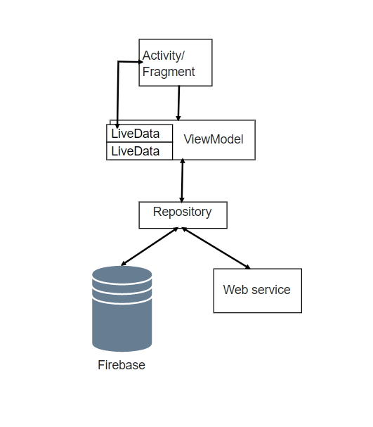
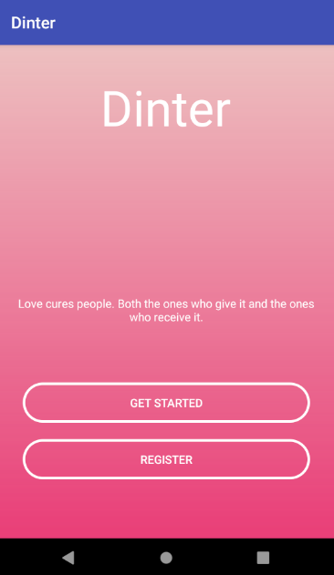
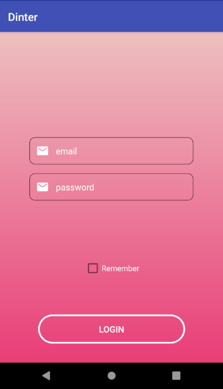
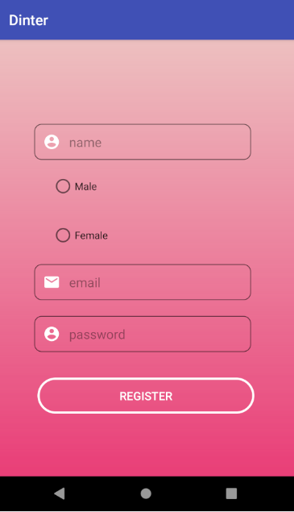
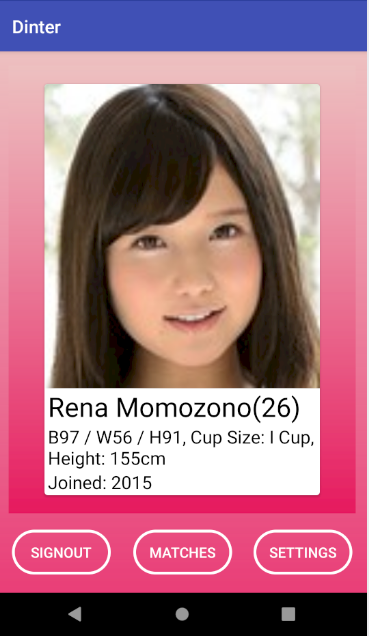
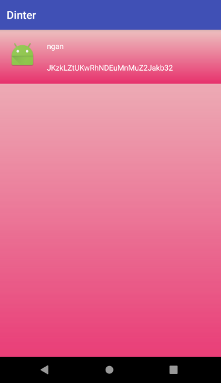
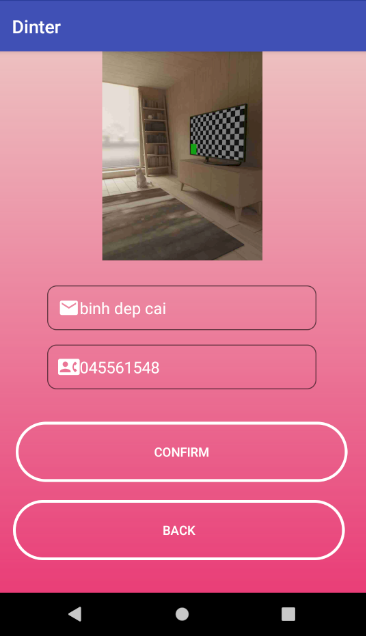

# PRM391
## Group members
* Bui Dang Binh
* Nguyen Minh
* Do Quang Minh
* Tu Anh Nguyen

## Overview
- This application will help individuals meet and date singles in their area.
- It allows users to like(swipe right), or dislike(swipe left) other users, and allows users to chat if both parties liked each other in the app.

## Functional requirement
- **Sign-in**: Users don’t want to waste too much time with long registration. So that, we created a quick sign-in feature via Facebook/Instagram, email, and/or phone number. Make sure that their personal data is fully protected.
- **Dating profile**: The users’ profile can be edited and added a person’s information such as age, location, brief description, interests, and hobbies. This is also important to arrange the profile sections in a simple and convenient way to show how **vjp pro** you are, and to help other users make decisions without hesitation.
- **Discover people / Matching**: Naturally, people prefer relationships in which they can meet the partner in person without too much trouble. Not everyone wants to text someone who is located miles away as it is less likely to meet them. The great option is people living in the same city or at least the same state.
- **Private messaging**: After users match each other, they can start chatting and get to know each other better. That’s what we use dating apps for. The dating app needs to fulfill their need to know partners with chat, video calls, upload pictures, other profiles. To improve the experience of using a dating app, Dinter considers implementing GIFS, symbols, stickers, or video calls for more advanced communication (in the future).

## Technologies

**Tech Stack:**

- Java/Android Studio
- Firebase (Realtime database/cloud storage)

## Data Structure

App's data is stored in the firebase realtime db (JSON format) and on the user's phone with SQLite. Local backups of your project file are made automatically each month.

### Account
**Users**
```javascript
{
  id: String, // auto-generated
  name: String,
  profile: String,
  profileImageUrl: String,
  gender: String,
  connections: {
      nopes: Array<userId: String>,
      yeps: Array<userId: String>,
      matches: Array<{userId: String, chatId: String}>
  }
}
```

### Chat

```javascript
{
  id: String, // auto-generated
  message: {
      messageId: String,
      content: String,
      userId: String
  }
}
```

## Screenshots









## For Version 2.0

- **Social network connection:** Ability to connect to other social network platform
- **GIFS, symbols, stickers, or video calls**
- **Premium/Payment platform**
- **Password hashing:** Passwords will be hashed before being saved to the database
- **Push notifications**
