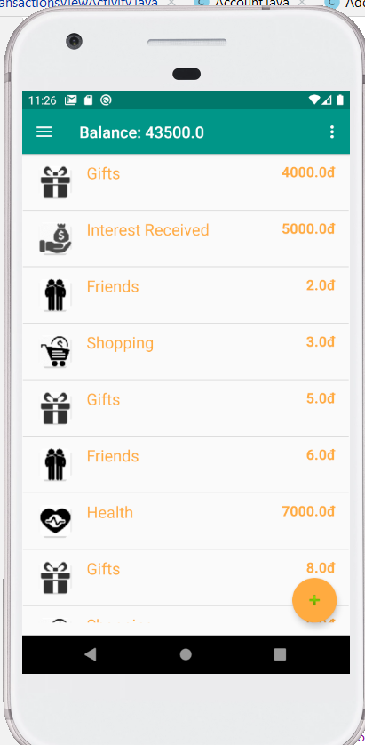
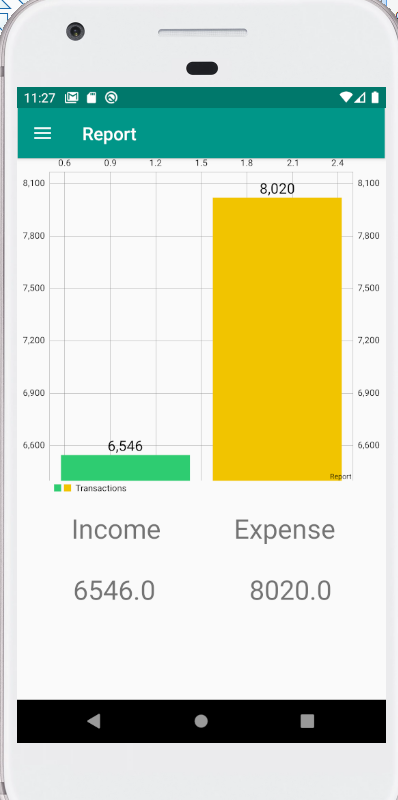
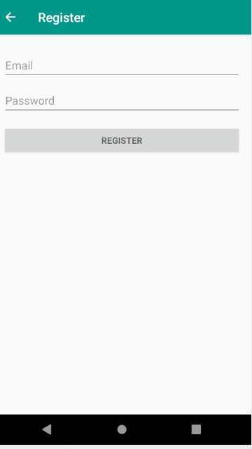

# PRM391
- I got the idea of this app by trying to find one really easy to use budget management app on my phone, I couldn't find one, so I made it my own.
- **Expense tracker** is a practical and versatile budget tracking and money management app. It is written in java, offer users an easy-to-read visualization of their finances and a detailed log of their spending habits. With this app, users can create budgets, set spending goals, and store information about recent purchases.
# Main features:
- Easily manage your costs and incomes
- Find your average daily cost
- Define your budget and trace it

## Group members
* Bui Dang Binh
* Nguyen Minh
* Do Quang Minh
* Tu Anh Nguyen

## Technologies

**Tech Stack:**

- Java/Android Studio
- Firebase
- SQLite

## Data Structure

App's data is stored in the firebase realtime db (JSON format) and on the user's phone with SQLite. Local backups of your project file are made automatically each month.

### Account

```javascript
{
  id: String, // auto-generated
  name: String,
  email: String,
  password: String,
}
```

### Transaction

```javascript
{
  id: String, // auto-generated
  accountId: String,
  date: String,
  note: String,
  category: String,
  type: String,
  amount: Number
}
```

### Wallet

```javascript
{
  balance: String
}
```

## Features

- The interactive dashboard features graphs, which segment the user’s expenditures into categories, and auto-updating widgets, which illustrate spending metrics and statistics. The user enters budgets for categories along with a date range that is used to display spending stats over that particular time period.

- The bar graph show stats based on the user's spending habits within the last 30 days. The bar graph shows the average amount spent per category, while the donut chart displays the total amount spent.

- The Budget Remaining widget's progress bars graphically represent the remaining money in the user's budget. Two more widgets display the average and total amounts spent per category within the specified date range. Everything on the dashboard updates in real time as the user adds a new budget or a new expenditure.

- There are beauty and functionality in simplicity, and the user's flow is kept direct and clean. The user inputs budget and expenditure information in modal window forms that do not take them away from the main dashboard, keeping the user experience focused.

## Screenshots
### Accounts






## For Version 2.0

- **More chart control:** Ability to customize the categories and timeframes the charts display
- **Badges:** Badges for certain milestones, such as staying under budget for a given period of time
- **Password hashing:** Passwords will be hashed before being saved to the database
